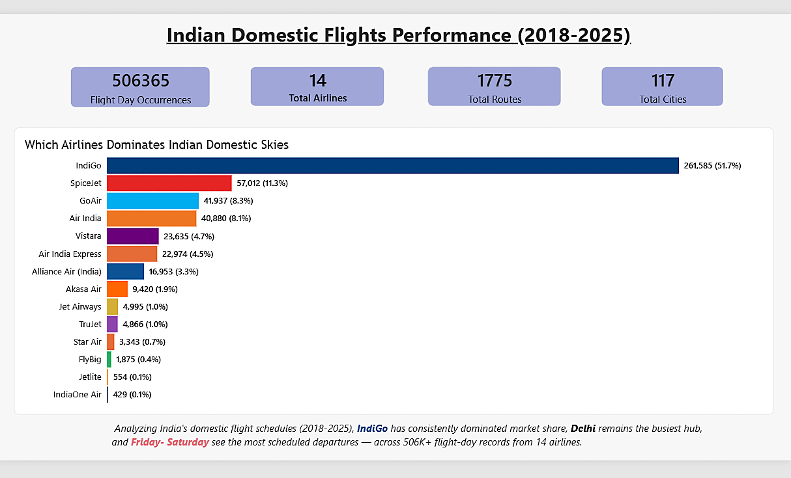
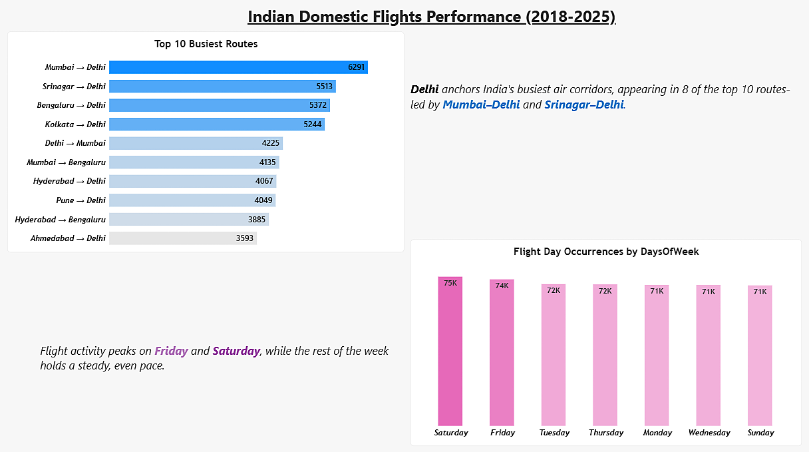
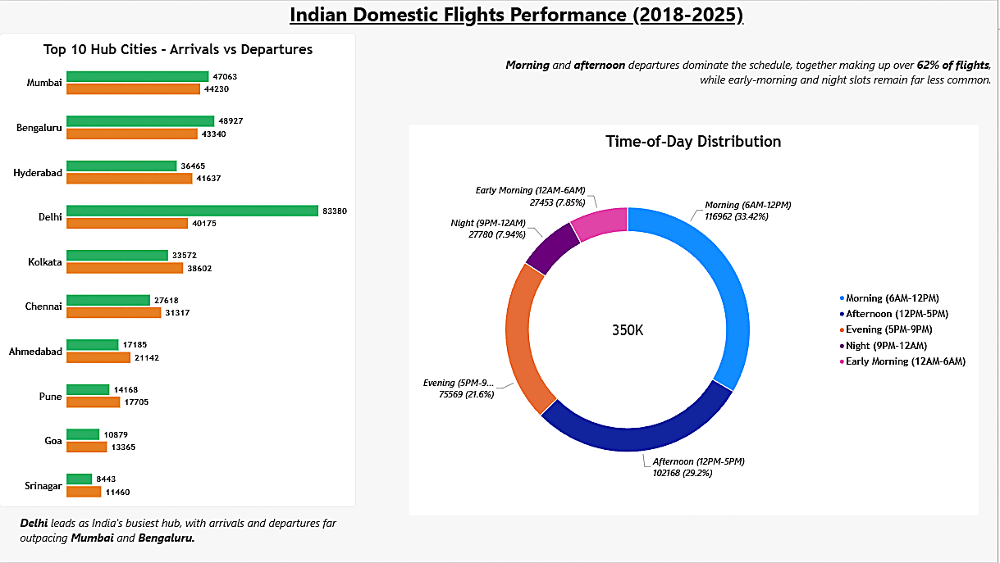
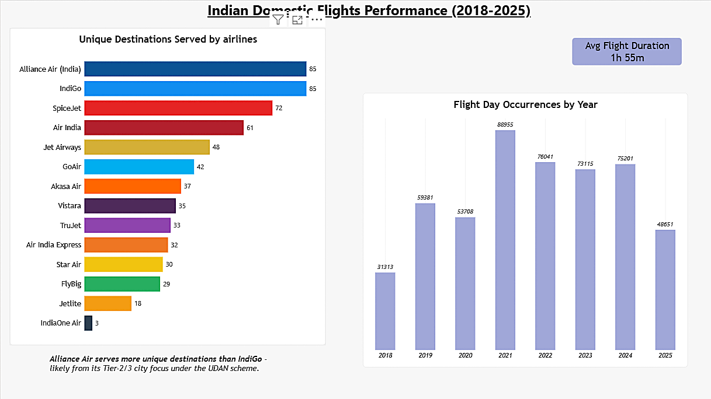
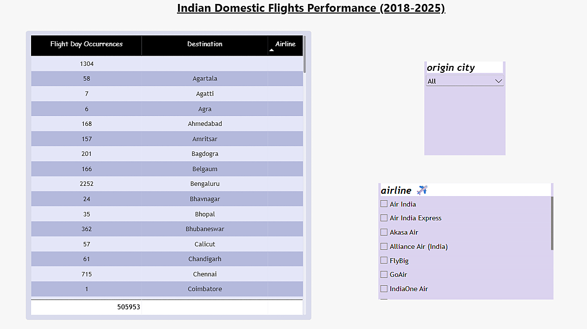

# ✈️ Indian Domestic Flights Performance Analytics (2018-2025)

## 📌 Project Overview
This project analyzes a comprehensive dataset of over 500,000 Indian domestic flight scheduling records. The multi-page Power BI report provides actionable insights into route frequency, hub performance, airline market share, and time-of-day operational trends to understand the dynamics of India's aviation network.

## 📂 Dataset
The raw dataset used for this analysis is included in this repository: [flights_data.csv](flights_data.csv) 
*(Original data source: https://www.kaggle.com/datasets/kabil007/indian-domestic-airline-dataset)*

## 🛠️ Tools & Technologies Used
* **Power BI:** Data visualization, DAX measure creation, relational data modeling.
* **Data Cleaning & ETL (Power Query):** Imported the raw dataset (`flights_data.csv`) and performed data transformations directly within Power BI. Steps included standardizing text capitalization, formatting slicer variables, handling missing values, and building a relational model.

## 📊 The Dashboard
The interactive report consists of 5 structured pages:

**1. Flights Analytics (Overview)**

* Tracks macro-level KPIs and daily scheduling patterns.

**2. Route & Schedule Analysis**

* Identifies the top 10 busiest air corridors (led by Mumbai–Delhi).

**3. City & Timing Distribution**

* Analyzes hub traffic vs. time-of-day slot utilization (Morning vs. Night flights).

**4. Airline & Trend Analysis**

* Tracks yearly scheduling validity trends and unique destinations served by 14 distinct airlines.

**5. City Explorer**

* A dedicated interactive tool for drilling down into specific origin cities to view precise route and airline breakdowns.

## 💡 Key Insights
* **Hub Dominance:** Delhi serves as the primary anchor for India's aviation network, appearing in 8 of the top 10 busiest domestic routes, closely followed by Mumbai and Bengaluru.
* **Time-of-Day Concentration:** Over 62% of all scheduled flights operate during the Morning (6 AM - 12 PM) and Afternoon (12 PM - 5 PM) blocks, indicating heavy runway saturation during daylight hours compared to overnight slots.
* **Peak Operations:** Flight scheduling activity peaks slightly on Fridays and Saturdays as airlines optimize for weekend travel demand.
* **Network Strategy:** While major carriers dominate high-volume routes, regional airlines like Alliance Air maintain competitive footprints by serving a high number of unique destinations (85), likely driven by Tier-2/3 city focus.
* **Duration & Efficiency:** The national average flight duration sits at 1 hour 55 minutes, reflecting the dense geographic proximity of India's major commercial hubs.
